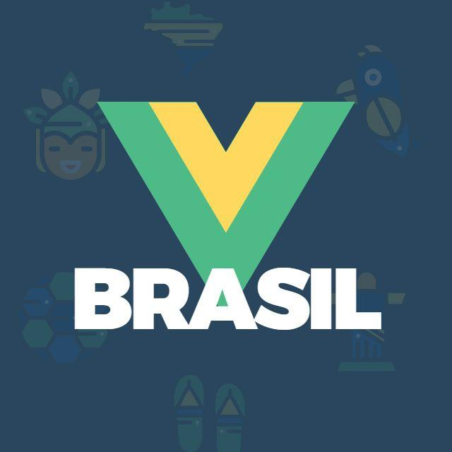

# Comunidade brasileira de Vue.js 🔥

Apoios e planos de patrocínio

* [Sobre a comunidade](#sobre)
* [As atividades](#as-atividades)
* [Por que Patrocinar?](#por-que-patrocinar)
* [Patrocínio](#patrocínio)
* [Contato](#contato)

## Sobre

A comunidade Vue.js Brasil é a maior comunidade sobre o Framework/lib Vue.js do brasil e é suportada por diversos locais.

Tem como principais objetivos: difundir o Vue.js; promover a troca de experiências e conhecimento; incentivar o crescimento da comunidade impactando economicamente e socialmente.

Seu público é composto, principalmente, por pessoas nas áreas de desenvolvimento, engenharia de software, empresarial, gerentes de TI, acadêmica, estudantes e entusiastas.

Durante os eventos, os participantes podem aprender sobre novas tecnologias, compartilhar conhecimento e experiências, ter contato com grandes nomes da comunidade nacional e internacional. Tudo isso em um ambiente amistoso, de boa convivência, inclusivo e livre de intimidações, onde todas as pessoas são bem-vindas.

## As atividades 

// TODO:

## Por que Patrocinar?

// TODO:

## Impacto

A comunidade no total tem **+10k** membros.

_É importante esclarecer que a quantidade de inscrições é limitada de acordo com o espaço onde o evento é realizado ou se ele é online._

## Quem já cedeu espaço para os eventos ❤️

## Patrocínio

// TODO:

## Contato

Alguma dúvida? Entre em contato com a organização através do [contato@vuejsbrasil.org](mailto:contato@vuejsbrasil.org)

> _Foi usado como ref o guia do [golang sp](https://github.com/golangsp/plano-patrocinio/)_
